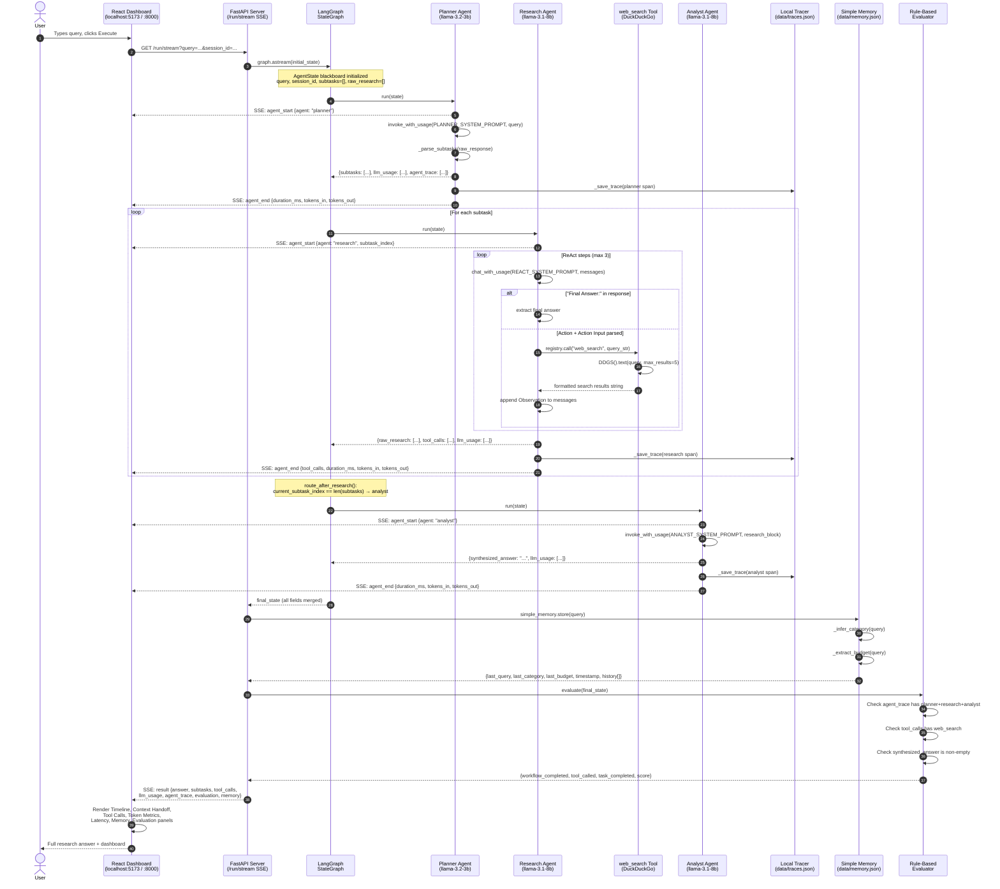

# MARS-Lite — Multi-Agent Research System (Educational Edition)

> **A simplified, transparent, and educational multi-agent AI research pipeline**
> LLM Gateway: OpenRouter · Orchestration: LangGraph · Frontend: React + Vite · API: FastAPI

[](https://python.org)
[](https://fastapi.tiangolo.com)
[](https://react.dev)
[](https://langchain-ai.github.io/langgraph/)

---

## What is MARS-Lite?

MARS-Lite is an **educational multi-agent research assistant** stripped down from the full [MARS](https://github.com/KolipakaRamesh/MARS) system. It is designed to help you **visually understand** every step of a multi-agent AI pipeline — what each agent does, what context it hands off, which tools it calls, how many tokens it uses, and how long each step takes.

The UI behaves like a **mini LangSmith / Langfuse dashboard** built right into the application.

### What MARS-Lite Teaches You

| Concept | How MARS-Lite demonstrates it |
|---|---|
| **Agent Orchestration** | 3-agent LangGraph pipeline: Planner → Research → Analyst |
| **Context Handoff** | Each agent's input & output shown in the Context Handoff panel |
| **Tool Calling** | `web_search` tool calls shown with input, output, and duration |
| **Memory** | Simple JSON file stores last query, category, budget, timestamp |
| **Observability** | Per-agent spans with start/end time, duration, token counts |
| **Evaluation** | Rule-based scoring: workflow completed, tool called, task done |
| **Token Usage** | Per-agent token breakdown (in / out / total) with visual bars |
| **Latency Tracking** | Per-agent duration with proportional bar chart + total time |

---

## Runtime Flow

The following sequence diagram shows the **exact execution path** of a single research query through MARS-Lite, from the moment the user clicks Execute to the final result rendered in the UI.



---

## Architecture

```
┌─────────────────────────────────────────────────────────────────┐
│                    React Single-Page Dashboard                  │
│  Timeline │ Context Handoff │ Tool Calls │ Tokens │ Latency     │
│  Memory Panel │ Evaluation Panel │ Research Answer              │
└──────────────────────────┬──────────────────────────────────────┘
                           │ GET /run/stream (SSE)
┌──────────────────────────▼──────────────────────────────────────┐
│                  FastAPI Server  (:8000)                         │
│  POST /run · GET /run/stream · GET /traces · GET /memory        │
│  Also serves frontend/dist/ as static files                     │
└──────────────────────────┬──────────────────────────────────────┘
                           │ graph.astream(state)
┌──────────────────────────▼──────────────────────────────────────┐
│                  LangGraph StateGraph                            │
│                                                                  │
│   ┌──────────┐    ┌──────────────────────────────┐    ┌───────┐ │
│   │ Planner  │───►│   Research (loop per subtask)│───►│Analyst│ │
│   │ llama-3b │    │   llama-8b + web_search tool │    │llama- │ │
│   │ temp=0.0 │    │   ReAct: Thought→Action→Obs  │    │  8b   │ │
│   └──────────┘    └──────────────────────────────┘    └───┬───┘ │
└──────────────────────────────────────────────────────────┼──────┘
                                                           │
              ┌────────────────────┬──────────────────────┘
              │                    │
   ┌──────────▼──────┐   ┌────────▼──────────┐
   │  Simple Memory  │   │  Rule-Based Eval  │
   │ data/memory.json│   │  (no LLM judge)   │
   └─────────────────┘   └───────────────────┘
              │
   ┌──────────▼──────┐
   │  Local Tracer   │
   │ data/traces.json│
   └─────────────────┘
```

---

## Agent Reference

### Agent 1 — Planner

| Property | Value |
|---|---|
| **File** | `backend/agents/planner.py` |
| **Model** | `meta-llama/llama-3.2-3b-instruct` |
| **Temperature** | `0.0` (deterministic) |
| **Max Tokens** | `512` |
| **Purpose** | Decomposes one complex query into 2–3 ordered atomic subtasks |

Outputs a JSON array of subtasks. Falls back to treating the full query as a single subtask if parsing fails. Fast and cheap model — task decomposition doesn't need deep reasoning.

---

### Agent 2 — Research (ReAct Loop)

| Property | Value |
|---|---|
| **File** | `backend/agents/research.py` |
| **Model** | `meta-llama/llama-3.1-8b-instruct` |
| **Temperature** | `0.2` |
| **Max Tokens** | `1024` |
| **Max ReAct Steps** | `3` per subtask |
| **Tool** | `web_search` (DuckDuckGo, no API key required) |
| **Purpose** | Executes each subtask via Thought → Action → Observation loop |

The ReAct loop runs as a multi-turn chat conversation. The agent keeps responding with Thought/Action/Action Input blocks until it writes `Final Answer:`. Each tool call is timed and recorded for the UI.

---

### Agent 3 — Analyst

| Property | Value |
|---|---|
| **File** | `backend/agents/analyst.py` |
| **Model** | `meta-llama/llama-3.1-8b-instruct` |
| **Temperature** | `0.3` |
| **Max Tokens** | `1024` |
| **Purpose** | Synthesizes all raw research chunks into one structured markdown answer |

Single-pass synthesis. Receives all `raw_research[]` chunks concatenated into a block and produces a coherent, grounded markdown answer.

---

## Dashboard Panels

| # | Panel | Data Source | Updates |
|---|---|---|---|
| 1 | **Timeline** | SSE `agent_start` / `agent_end` events | Real-time during run |
| 2 | **Context Handoff** | `result.subtasks`, `result.tool_calls`, `result.answer` | After run completes |
| 3 | **Tool Calls** | `result.tool_calls[]` — each `web_search` invocation | After run completes |
| 4 | **Token Metrics** | SSE `agent_end.tokens_in/out/total` per agent | Real-time during run |
| 5 | **Latency Metrics** | SSE `agent_end.duration_ms` per agent | Real-time during run |
| 6 | **Memory** | `GET /memory` → `data/memory.json` | On load + after run |
| 7 | **Evaluation** | Rule-based: workflow / tool / task checks | After run completes |

---

## Memory System

**File:** `backend/memory/simple_memory.py`
**Storage:** `data/memory.json`

Stores the last 10 query sessions locally. No embeddings, no vector search.

```json
{
  "last_query":    "What is RAG in AI?",
  "last_category": "AI/ML",
  "last_budget":   null,
  "timestamp":     "2025-06-17T06:51:00Z",
  "history": [
    { "last_query": "...", "last_category": "...", "timestamp": "..." }
  ]
}
```

Categories are inferred from keywords: `AI/ML`, `Finance`, `Science`, `Technology`, `Health`, `General`.

---

## Observability System

**File:** `backend/observability/tracer.py`
**Storage:** `data/traces.json`

The `@trace_agent("name")` decorator wraps every agent's `run()` method and records a span automatically. Spans are persisted to disk and also pushed to the SSE queue for real-time streaming.

**Span schema:**
```json
{
  "request_id":   "mars-lite-1718608860000",
  "agent_name":   "research",
  "start_time":   "2025-06-17T06:51:01.234Z",
  "end_time":     "2025-06-17T06:51:09.876Z",
  "duration_ms":  8642.0,
  "status":       "success",
  "tokens_in":    1240,
  "tokens_out":   420,
  "total_tokens": 1660,
  "model":        "meta-llama/llama-3.1-8b-instruct"
}
```

Access all stored spans via `GET /traces`. Clear them via `DELETE /traces`.

---

## Evaluation System

**File:** `backend/evaluation/evaluator.py`

Rule-based, deterministic checks. No LLM judge. No latency. No extra API cost.

| Criterion | Check | Points |
|---|---|---|
| `workflow_completed` | All 3 agents appear in `agent_trace` | 33 |
| `tool_called` | At least one `web_search` in `tool_calls` | 33 |
| `task_completed` | `synthesized_answer` is non-empty | 33 + 1 bonus |

**Score:** `0`, `33`, `66`, or `100`

```json
{
  "workflow_completed": true,
  "tool_called": true,
  "task_completed": true,
  "score": 100,
  "details": {
    "agents_seen": ["analyst", "planner", "research"],
    "tool_calls_count": 2,
    "answer_length": 1847
  }
}
```

---

## Project Structure

```
MARS-Lite/
├── backend/
│   ├── api/
│   │   └── main.py              # FastAPI routes + SSE streaming
│   ├── agents/
│   │   ├── base.py              # BaseAgent with _trace() helper
│   │   ├── planner.py           # Query decomposition agent
│   │   ├── research.py          # ReAct tool-use loop agent
│   │   ├── analyst.py           # Synthesis agent
│   │   └── prompts.py           # All system prompts centralized
│   ├── orchestration/
│   │   ├── graph.py             # LangGraph StateGraph (3 nodes, no retry)
│   │   ├── state.py             # AgentState TypedDict (blackboard)
│   │   └── router.py            # route_after_research() only
│   ├── memory/
│   │   └── simple_memory.py     # JSON file memory (no embeddings)
│   ├── tools/
│   │   ├── registry.py          # ToolRegistry (web_search only)
│   │   └── web_search.py        # DuckDuckGo search
│   ├── llm/
│   │   ├── provider.py          # LLMProvider abstract base
│   │   └── openrouter_provider.py  # OpenRouter via OpenAI-compat API
│   ├── observability/
│   │   └── tracer.py            # @trace_agent decorator + SSE push
│   ├── evaluation/
│   │   └── evaluator.py         # Rule-based evaluator (no LLM judge)
│   └── config/
│       └── settings.py          # Pydantic BaseSettings
├── frontend/
│   └── src/
│       ├── App.jsx              # Full dashboard UI (7 panels, SSE client)
│       ├── App.css              # Dark-mode high-contrast design system
│       └── main.jsx             # React entry point
├── scripts/
│   └── smoke_test.py            # Module import + factory validation
├── data/                        # Auto-created at runtime
│   ├── memory.json              # Simple query memory store
│   └── traces.json              # Observability span store
├── requirements.txt             # Python dependencies
├── .env                         # API key (not committed)
└── .env.example                 # Template for .env
```

---

## Quick Start

### Prerequisites

- Python 3.11+
- Node.js 18+
- An [OpenRouter](https://openrouter.ai) API key (free tier available — create one at openrouter.ai/keys)

### 1. Clone & Configure

```bash
git clone https://github.com/KolipakaRamesh/MARS-Lite.git
cd MARS-Lite
```

Copy the environment template and add your key:
```bash
cp .env.example .env
```

Edit `.env`:
```env
OPENROUTER_API_KEY=sk-or-v1-...
```

### 2. Install Python Dependencies

```bash
pip install -r requirements.txt
```

### 3. Start the Backend

```bash
python -m uvicorn backend.api.main:app --port 8000
```

The server starts on `http://localhost:8000` and automatically serves the pre-built frontend from `frontend/dist/`.

### 4. Open the Dashboard

Navigate to **[http://localhost:8000](http://localhost:8000)** in your browser.

Type a question and click **Execute** to watch the entire pipeline run in real time.

### 5. (Optional) Frontend Dev Server

If you want to modify the UI with hot-reloading:

```bash
cd frontend
npm install
npm run dev    # Dev server at http://localhost:5173
```

Then also run the backend at `:8000` so API calls succeed.

To rebuild the production bundle (served by FastAPI):
```bash
cd frontend
npm run build   # Outputs to frontend/dist/
```

---

## API Reference

### `GET /run/stream` — SSE Streaming Endpoint *(primary)*

Streams real-time agent events as Server-Sent Events.

**Query params:** `query` (required), `session_id` (optional)

**Event types:**

| Event | When | Key fields |
|---|---|---|
| `agent_start` | Agent begins | `agent`, `timestamp`, `query` |
| `agent_end` | Agent finishes | `agent_name`, `duration_ms`, `tokens_in`, `tokens_out`, `tool_calls` |
| `result` | Pipeline done | `answer`, `subtasks`, `tool_calls`, `llm_usage`, `evaluation`, `memory` |
| `error` | Pipeline failed | `detail` |

### `POST /run` — Blocking Endpoint

Runs the full pipeline and returns when complete.

**Request:**
```json
{ "query": "What is RAG in AI?", "session_id": "optional-id" }
```

**Response:**
```json
{
  "session_id": "mars-lite-123",
  "query": "What is RAG in AI?",
  "answer": "# Answer to: ...\n## Summary\n...",
  "subtasks": ["Define RAG", "Find use cases"],
  "tool_calls": [
    { "tool": "web_search", "input": "RAG retrieval augmented generation", "output": "...", "duration_ms": 1240, "timestamp": "..." }
  ],
  "llm_usage": [
    { "agent": "planner",  "model": "llama-3.2-3b-instruct", "prompt_tokens": 120, "completion_tokens": 55,  "total_tokens": 175,  "latency_ms": 510 },
    { "agent": "research", "model": "llama-3.1-8b-instruct", "prompt_tokens": 980, "completion_tokens": 340, "total_tokens": 1320, "latency_ms": 3200 },
    { "agent": "analyst",  "model": "llama-3.1-8b-instruct", "prompt_tokens": 1400,"completion_tokens": 620, "total_tokens": 2020, "latency_ms": 4100 }
  ],
  "evaluation": { "workflow_completed": true, "tool_called": true, "task_completed": true, "score": 100 },
  "memory": { "last_query": "What is RAG in AI?", "last_category": "AI/ML", "last_budget": null, "timestamp": "..." }
}
```

### `GET /health`
```json
{ "status": "ok", "system": "MARS-Lite", "graph_ready": true }
```

### `GET /traces` / `DELETE /traces`
Returns or clears all stored observability spans from `data/traces.json`.

### `GET /memory` / `DELETE /memory`
Returns or clears the simple memory store from `data/memory.json`.

---

## Configuration Reference

All settings are in `backend/config/settings.py` and loaded from `.env`:

| Variable | Default | Required | Description |
|---|---|---|---|
| `OPENROUTER_API_KEY` | — | ✅ Yes | Your OpenRouter API key |
| `PLANNER_MODEL` | `meta-llama/llama-3.2-3b-instruct` | No | Planner LLM model ID |
| `RESEARCH_MODEL` | `meta-llama/llama-3.1-8b-instruct` | No | Research LLM model ID |
| `ANALYST_MODEL` | `meta-llama/llama-3.1-8b-instruct` | No | Analyst LLM model ID |
| `MAX_REACT_STEPS` | `3` | No | Max ReAct iterations per subtask |
| `API_HOST` | `0.0.0.0` | No | Uvicorn bind host |
| `API_PORT` | `8000` | No | Uvicorn bind port |

---

## Technology Stack

| Layer | Technology | Role |
|---|---|---|
| **LLM Gateway** | OpenRouter | Routes to any model via OpenAI-compatible API |
| **LLM Models** | Meta Llama 3.x (3b, 8b) | Agent intelligence at low cost |
| **Orchestration** | LangGraph | Stateful graph-based pipeline |
| **API Server** | FastAPI + Uvicorn | HTTP + SSE streaming server |
| **Frontend** | React 19 + Vite | Real-time observability dashboard |
| **Web Search** | DuckDuckGo (duckduckgo-search) | No API key required |
| **Memory** | JSON file (`data/memory.json`) | Zero-dependency, local persistence |
| **Observability** | Local tracer (`data/traces.json`) | No external service needed |
| **Evaluation** | Rule-based (pure Python) | No LLM judge, instant results |
| **Config** | Pydantic BaseSettings | Type-safe environment variable management |
| **Resiliency** | tenacity | Retry with exponential backoff for LLM calls |

---

## What Was Removed from Full MARS

MARS-Lite is a deliberate simplification. The following were intentionally removed:

| Removed | Reason |
|---|---|
| `ReviewerAgent` (LLM-as-judge) | Replaced by rule-based evaluator |
| Quality scoring + retry loops | Adds complexity, not educational value here |
| `wiki_search`, `calculator`, `file_reader` | Reduced to one tool for clarity |
| Convex backend (heartbeats, sessions, vector DB) | Local JSON files used instead |
| Vector embeddings + RAG retrieval | No embedding model needed |
| Opik / Comet tracing | Local file tracer replaces it |
| `long_term.py`, `episodic.py` | Replaced by `simple_memory.py` |

---

## Try These Queries

```
What is Retrieval-Augmented Generation (RAG)?
How does LangGraph work for multi-agent systems?
Latest advances in AI agents 2025
Best laptops under ₹80,000 in India
What is the difference between GPT-4 and Claude?
How does DuckDuckGo protect user privacy?
```

---

## Remaining Technical Debt

| Item | Notes |
|---|---|
| **Concurrent write races** | `data/memory.json` and `data/traces.json` are not thread-safe under concurrent requests |
| **Token tracking fallback** | If OpenRouter returns no usage data, token counts default to 0 |
| **DuckDuckGo rate limits** | No API key = vulnerable to `429 Too Many Requests` under load |
| **SSE reconnection** | Frontend does not retry a dropped SSE stream mid-run |
| **No auth** | The API has no authentication — suitable for local development only |
